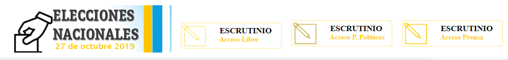
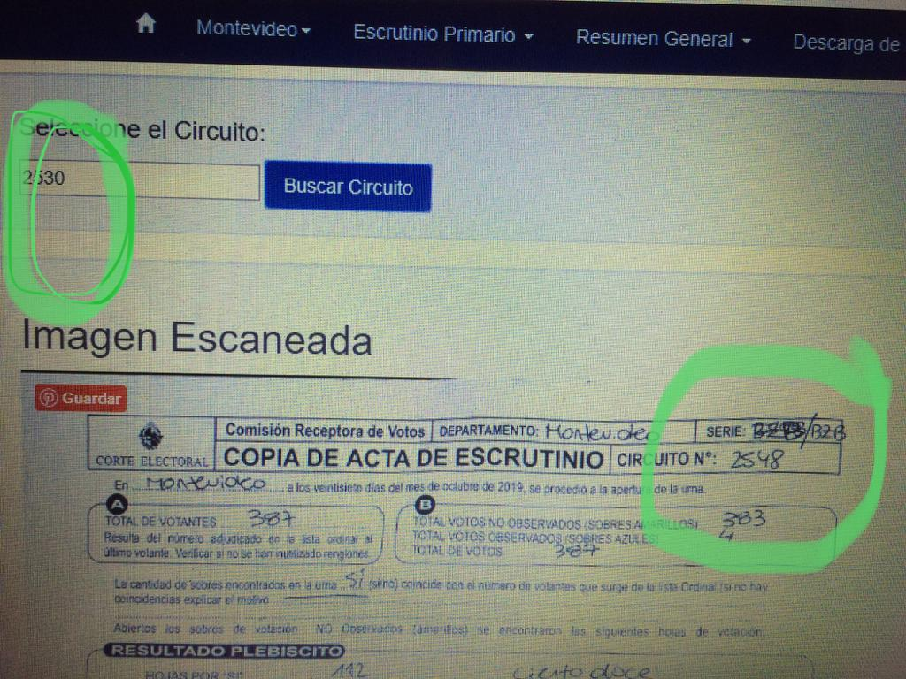

# elecciones-uy-2019

Pareciera que cuestionar el sagrado y venerado sistema electoral en Uruguay es una herejía, pero [yo estoy bastante alineado](https://www.linkedin.com/pulse/20141105162709-9925762--votodigital2020/) a lo que alguien tristemente famoso dijo "_Lo que cuenta no es el voto, sino quien cuenta los votos._"

[Escuché que ministros de la corte](https://delsol.uy/notoquennada/entrevistas/elecciones-dudas-frecuentes-y-la-ayuda-de-las-tablets-en-el-escrutinio) (minuto 16) comentaron que las actas de escrutinio de estas elecciones iban a estár escaneadas y disponibles para revisión por cualquiera que le interese.

Si se pretende dar transparencia al proceso me cuesta mucho entender porqué hay distintos niveles de acceso para los partidos politicos, prensa y público en general en la [web de la corte electoral](https://www.corteelectoral.gub.uy/).



No encontré aun las imagenes scaneadas de las actas, no se si no están aun (1 Nov) o simplemente no logré encontrarlas pero veo que hay personas que si tienen acceso y me llamó la atención [una denuncia de inconsistencia](https://twitter.com/sandrilu100/status/1189640526020206592) entre la información y el acta scaneada.



Aprovechando que tenía ganas de jugar un poco con las [APIs de ComputerVision](https://docs.microsoft.com/en-us/azure/cognitive-services/Computer-vision/quickstarts/python-hand-text) veo que sería relativamente sencillo armar algo automatizado para hacer una validación de consistencia.

Como no encontré las actas, saqué el modelo del [manual de procedimientos](https://www.corteelectoral.gub.uy/estadisticas/nacionales/elecciones-nacionales-2019/~8186/manual-de-procedimientos-3830), imprimí [una acta de prueba](https://github.com/andresantoniuk/elecciones-uy-2019/raw/master/actas/acta_prueba.jpg) y [armé algo básico en python](elecciones-uy-2019.ipynb) que interpreta bastante bien los datos.

Cuando encuentre disponible el total de las actas voy a tener bastante para seguir divirtiendome.

---
Se puede ejecutar el código python en
[](https://mybinder.org/v2/gh/andresantoniuk/elecciones-uy-2019/master).

Es necesario definir las siguientes variables de entorno con los datos de una [cuenta de Cognitive Services](https://docs.microsoft.com/en-us/azure/cognitive-services/cognitive-services-apis-create-account?tabs=multiservice%2Cwindows)

```
%env COMPUTER_VISION_SUBSCRIPTION_KEY=
%env COMPUTER_VISION_ENDPOINT=
```
